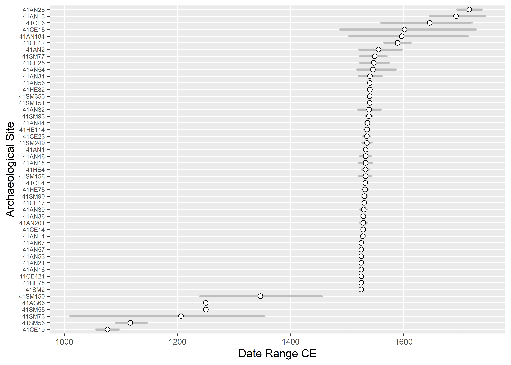

Mean ceramic dates for Caddo sites in the Neches River Basin
================
Robert Z. Selden, Jr.
June 8, 2020

## MCD for NRB

Mean ceramic dates were calculated borrowing methodologically using code
developed by Matthew A. Peeples, who was following Keith Kintigh, who
was channelling Stanley South (1977).

``` r
# set working directory
setwd(getwd())
mydata <- read.csv(file = 'nrb_mcd_data.csv', sep = ',', header = T, row.names = 1)
types <- as.matrix(colnames(mydata))

dates <- read.csv(file = 'nrb_type_dates.csv', sep = ',', header = T)
bc <- min(dates[,2:3])
dates[,2:3] <- dates[,2:3]+(bc*-1)

midpt <- as.matrix(((dates[,3]-dates[,2])/2)+dates[,2])
dates <- cbind(dates,midpt)

mydata2 <- mydata

mcd.calc <- function(x,types,dates) {
tot <- as.matrix(rowSums(x))
for (i in 1:nrow(types)) {
for (j in 1:nrow(dates)) {
if (types[i,] == dates[j,1]) 
{x[,i] <- x[,i] * dates[j,4]}}}

mcd <- matrix(0,nrow(mydata),1)
rownames(mcd) <- rownames(mydata)

newtot <- as.matrix(rowSums(x))

for (i in 1:nrow(mcd)) {
mcd[i,1] <- newtot[i,]/tot[i,]+bc}
return(mcd)}

mcd <- mcd.calc(mydata2,types,dates)

###############################################################################

nsim <- 1000

data.rowsum <- as.matrix(rowSums(mydata))
range <- matrix(0,nrow(mydata),2)

for (i in 1:nrow(mydata)) {
data.sim <- rmultinom(nsim,data.rowsum[i,],prob=mydata[i,])
data.sim <- t(data.sim)
temp <- mcd.calc(data.sim,types,dates)
range[i,1] <- mean(temp) - (sd(temp)*1.96)
range[i,2] <- mean(temp) + (sd(temp)*1.96)}

output <- cbind(row.names(mydata),mcd,range)
colnames(output) <- c('site','mcd','lower','higher')
output
```

    ##         site      mcd                lower              higher            
    ## 41SM56  "41SM56"  "1116.66666666667" "1089.99444502303" "1143.33888831031"
    ## 41SM55  "41SM55"  "1250"             "1250"             "1250"            
    ## 41SM77  "41SM77"  "1548.75"          "1521.35226520514" "1572.77018377445"
    ## 41SM90  "41SM90"  "1530.625"         "1525.58314223445" "1535.5903271533" 
    ## 41SM73  "41SM73"  "1206.25"          "1047.68615123723" "1408.18119570155"
    ## 41SM93  "41SM93"  "1538.5"           "1532.93765508911" "1543.75622246191"
    ## 41SM151 "41SM151" "1540"             "1540"             "1540"            
    ## 41SM158 "41SM158" "1532.5"           "1522.54805295432" "1542.45194704568"
    ## 41SM249 "41SM249" "1535"             "1527.96012100978" "1543.26436878614"
    ## 41SM150 "41SM150" "1346.66666666667" "1237.16104713712" "1446.30834061798"
    ## 41SM355 "41SM355" "1540"             "1540"             "1540"            
    ## 41SM2   "41SM2"   "1525"             "1525"             "1525"            
    ## 41HE114 "41HE114" "1535.26315789474" "1530.73910917995" "1539.20718512725"
    ## 41HE4   "41HE4"   "1532.5"           "1523.50194879934" "1540.12050018025"
    ## 41HE75  "41HE75"  "1531.66666666667" "1527.57546783727" "1536.57419202668"
    ## 41HE78  "41HE78"  "1525"             "1525"             "1525"            
    ## 41HE82  "41HE82"  "1540"             "1540"             "1540"            
    ## 41HE7   "41HE7"   "1528.75"          "1521.07655377458" "1535.04589520501"
    ## 41CE4   "41CE4"   "1532.14285714286" "1529.39087156834" "1535.30300598268"
    ## 41CE12  "41CE12"  "1589.13461538462" "1562.64902966708" "1615.40042088237"
    ## 41CE14  "41CE14"  "1528.57142857143" "1527.23945326625" "1529.9092347804" 
    ## 41CE15  "41CE15"  "1601.66666666667" "1497.3947557678"  "1691.10864559274"
    ## 41CE17  "41CE17"  "1530.19230769231" "1527.49239906365" "1533.15124300856"
    ## 41CE19  "41CE19"  "1076.27272727273" "1058.99886418832" "1096.13286122912"
    ## 41CE23  "41CE23"  "1535"             "1529.21645550315" "1541.19170776215"
    ## 41CE25  "41CE25"  "1547"             "1522.65209253461" "1574.6948462409" 
    ## 41CE421 "41CE421" "1525"             "1525"             "1525"            
    ## 41CE6   "41CE6"   "1645.83333333333" "1577.65198447997" "1709.25277742479"
    ## 41AN1   "41AN1"   "1532.75862068966" "1530.1463775962"  "1534.96973781548"
    ## 41AN13  "41AN13"  "1692.69230769231" "1649.5100935038"  "1736.64375265004"
    ## 41AN14  "41AN14"  "1527.72727272727" "1524.16542434556" "1531.90136600695"
    ## 41AN16  "41AN16"  "1525"             "1525"             "1525"            
    ## 41AN18  "41AN18"  "1532.5"           "1523.70121413614" "1542.52327565978"
    ## 41AN184 "41AN184" "1596.66666666667" "1481.42331207141" "1720.68553146601"
    ## 41AN2   "41AN2"   "1555.625"         "1524.52145462702" "1594.38160659747"
    ## 41AN21  "41AN21"  "1525"             "1525"             "1525"            
    ## 41AN26  "41AN26"  "1716.11111111111" "1693.16208543763" "1734.83489113078"
    ## 41AN32  "41AN32"  "1538.75"          "1518.44613300027" "1559.74774455075"
    ## 41AN34  "41AN34"  "1540.27777777778" "1518.13855599179" "1562.06552564087"
    ## 41AN38  "41AN38"  "1528.75"          "1524.19881750318" "1532.84199882335"
    ## 41AN39  "41AN39"  "1529.28571428571" "1525.01383708689" "1533.20773725714"
    ## 41AN44  "41AN44"  "1535.90909090909" "1531.12096931381" "1539.91799172516"
    ## 41AN48  "41AN48"  "1532.5"           "1523.70121413614" "1542.52327565978"
    ## 41AN53  "41AN53"  "1525"             "1525"             "1525"            
    ## 41AN54  "41AN54"  "1545.71428571429" "1514.30131318721" "1576.60247690026"
    ## 41AN56  "41AN56"  "1540"             "1540"             "1540"            
    ## 41AN57  "41AN57"  "1525"             "1525"             "1525"            
    ## 41AN67  "41AN67"  "1525"             "1525"             "1525"            
    ## 41AG66  "41AG66"  "1250"             "1250"             "1250"

``` r
write.table(output, file = 'mcd_out.csv', sep = ',', row.names = F)
```

## Plot MCD results with error bars

``` r
# plot mean ceramic dates with error bars

#install.packages("devtools")
#devtools::install_github("tidyverse/ggplot2")
library(tidyverse)
```

    ## -- Attaching packages --------------------------------------------- tidyverse 1.3.0 --

    ## v ggplot2 3.3.1     v purrr   0.3.4
    ## v tibble  3.0.1     v dplyr   1.0.0
    ## v tidyr   1.1.0     v stringr 1.4.0
    ## v readr   1.3.1     v forcats 0.5.0

    ## -- Conflicts ------------------------------------------------ tidyverse_conflicts() --
    ## x dplyr::filter() masks stats::filter()
    ## x dplyr::lag()    masks stats::lag()

``` r
# read mcd_out
caddo <- read.csv("mcd_out.csv", header = TRUE, as.is = TRUE)

# reorder sites by mcd
caddo$site
```

    ##  [1] "41SM56"  "41SM55"  "41SM77"  "41SM90"  "41SM73"  "41SM93"  "41SM151"
    ##  [8] "41SM158" "41SM249" "41SM150" "41SM355" "41SM2"   "41HE114" "41HE4"  
    ## [15] "41HE75"  "41HE78"  "41HE82"  "41HE7"   "41CE4"   "41CE12"  "41CE14" 
    ## [22] "41CE15"  "41CE17"  "41CE19"  "41CE23"  "41CE25"  "41CE421" "41CE6"  
    ## [29] "41AN1"   "41AN13"  "41AN14"  "41AN16"  "41AN18"  "41AN184" "41AN2"  
    ## [36] "41AN21"  "41AN26"  "41AN32"  "41AN34"  "41AN38"  "41AN39"  "41AN44" 
    ## [43] "41AN48"  "41AN53"  "41AN54"  "41AN56"  "41AN57"  "41AN67"  "41AG66"

``` r
caddo$site <- factor(caddo$site, levels = caddo$site[order(caddo$mcd)])
caddo$site
```

    ##  [1] 41SM56  41SM55  41SM77  41SM90  41SM73  41SM93  41SM151 41SM158 41SM249
    ## [10] 41SM150 41SM355 41SM2   41HE114 41HE4   41HE75  41HE78  41HE82  41HE7  
    ## [19] 41CE4   41CE12  41CE14  41CE15  41CE17  41CE19  41CE23  41CE25  41CE421
    ## [28] 41CE6   41AN1   41AN13  41AN14  41AN16  41AN18  41AN184 41AN2   41AN21 
    ## [37] 41AN26  41AN32  41AN34  41AN38  41AN39  41AN44  41AN48  41AN53  41AN54 
    ## [46] 41AN56  41AN57  41AN67  41AG66 
    ## 49 Levels: 41CE19 41SM56 41SM73 41SM55 41AG66 41SM150 41SM2 41HE78 ... 41AN26

``` r
# define variables
Site <- caddo$site
Mean_Ceramic_Date_CE <- caddo$mcd
lower <- caddo$lower
upper <- caddo$higher

# plot
cs = theme(
  axis.title.x = element_text(size = 11),
  axis.text.x = element_text(size = 8),
  axis.title.y = element_text(size = 11),
  axis.text.y = element_text(size = 6))

ggplot() +
  geom_errorbar(data = caddo, mapping = aes(x = Site, ymin = lower, ymax = upper), width = 0.2, size = 1, colour = "springgreen4") +
  geom_point(data = caddo, mapping = aes(x = Site, y = Mean_Ceramic_Date_CE), size = 2, shape = 21, fill = "white") +
  coord_flip() + # provides a representation of time similar to what archaeologists are used to seeing
  cs
```



``` r
# end of code
```
