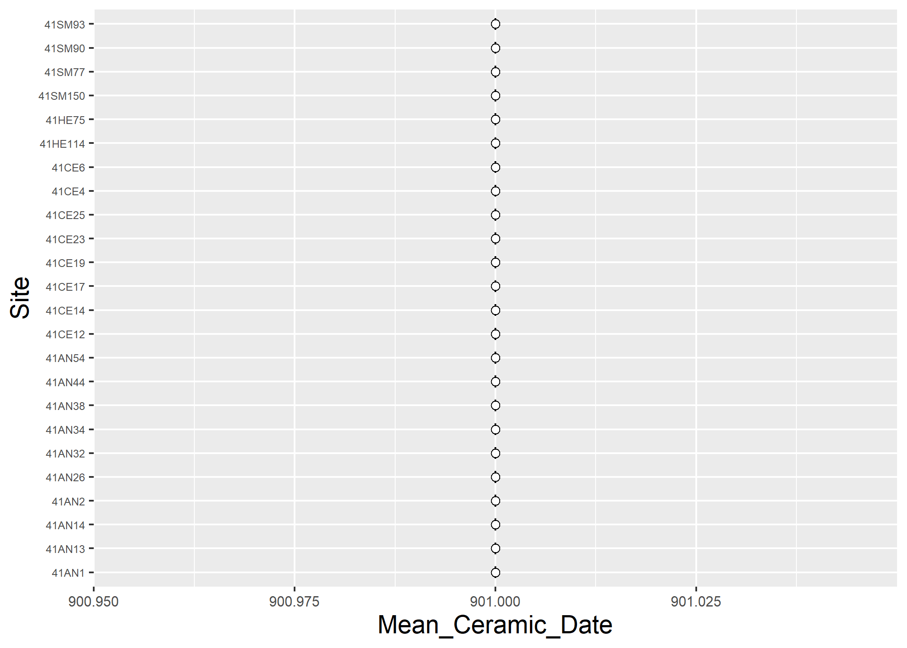

Mean ceramic dates for Caddo sites in the Neches River Basin
================
Robert Z. Selden, Jr.
June 8, 2020

## Including all sites and vessels

The code chunk below was developed by Matthew A. Peeples, following
Keith Kintigh, who was channelling Stanley South (1977).

``` r
# this code chunk was repurposed from Matthew A. Peeples excellent example (link above)
# set working directory
setwd(getwd())
mydata <- read.csv(file = 'nrb_mcd_data.csv', sep = ',', header = T, row.names = 1)
types <- as.matrix(colnames(mydata))

dates <- read.csv(file = 'nrb_type_dates.csv', sep = ',', header = T)
bc <- min(dates[,2:3])
dates[,2:3] <- dates[,2:3]+(bc*-1)

midpt <- as.matrix(((dates[,3]-dates[,2])/2)+dates[,2])
dates <- cbind(dates,midpt)

mydata2 <- mydata


mcd.calc <- function(x,types,dates) {
tot <- as.matrix(rowSums(x))
for (i in 1:nrow(types)) {
for (j in 1:nrow(dates)) {
if (types[i,] == dates[j,1]) 
{x[,i] <- x[,i] * dates[j,4]}}}

mcd <- matrix(0,nrow(mydata),1)
rownames(mcd) <- rownames(mydata)

newtot <- as.matrix(rowSums(x))

for (i in 1:nrow(mcd)) {
mcd[i,1] <- newtot[i,]/tot[i,]+bc}
return(mcd)}

mcd <- mcd.calc(mydata2,types,dates)

###############################################################################

nsim <- 1000

data.rowsum <- as.matrix(rowSums(mydata))
range <- matrix(0,nrow(mydata),2)

for (i in 1:nrow(mydata)) {
data.sim <- rmultinom(nsim,data.rowsum[i,],prob=mydata[i,])
data.sim <- t(data.sim)
temp <- mcd.calc(data.sim,types,dates)
range[i,1] <- mean(temp) - (sd(temp)*1.96)
range[i,2] <- mean(temp) + (sd(temp)*1.96)}

output <- cbind(row.names(mydata),mcd,range)
colnames(output) <- c('site','mcd','lower','higher') #modified from Peeples' code
output
```

    ##         site      mcd                lower              higher            
    ## 41SM56  "41SM56"  "1116.66666666667" "1090.19628735313" "1141.77650176252"
    ## 41SM55  "41SM55"  "1250"             "1250"             "1250"            
    ## 41SM77  "41SM77"  "1548.75"          "1524.36134264421" "1576.58763694762"
    ## 41SM90  "41SM90"  "1530.625"         "1525.36305064907" "1535.81041873869"
    ## 41SM73  "41SM73"  "1206.25"          "1025.6313071512"  "1391.20542754268"
    ## 41SM93  "41SM93"  "1538.5"           "1533.23331470208" "1544.25648121629"
    ## 41SM151 "41SM151" "1540"             "1540"             "1540"            
    ## 41SM158 "41SM158" "1532.5"           "1521.32610622983" "1543.36777132119"
    ## 41SM249 "41SM249" "1535"             "1525.98303007558" "1541.97615359789"
    ## 41SM150 "41SM150" "1346.66666666667" "1250.66410346559" "1452.53317544598"
    ## 41SM355 "41SM355" "1540"             "1540"             "1540"            
    ## 41SM2   "41SM2"   "1525"             "1525"             "1525"            
    ## 41HE114 "41HE114" "1535.26315789474" "1529.86496551149" "1539.59797756048"
    ## 41HE4   "41HE4"   "1532.5"           "1525.32861894866" "1539.21219737787"
    ## 41HE75  "41HE75"  "1531.66666666667" "1527.45223084433" "1536.90151065227"
    ## 41HE78  "41HE78"  "1525"             "1525"             "1525"            
    ## 41HE82  "41HE82"  "1540"             "1540"             "1540"            
    ## 41HE7   "41HE7"   "1528.75"          "1521.99081632653" "1534.59081632653"
    ## 41CE4   "41CE4"   "1532.14285714286" "1529.67992310111" "1534.7224092604" 
    ## 41CE12  "41CE12"  "1589.13461538462" "1568.17886856714" "1609.53306235908"
    ## 41CE14  "41CE14"  "1528.57142857143" "1527.04846277959" "1529.91946724957"
    ## 41CE15  "41CE15"  "1601.66666666667" "1489.29555550284" "1706.28267578967"
    ## 41CE17  "41CE17"  "1530.19230769231" "1527.21689375438" "1533.19126951093"
    ## 41CE19  "41CE19"  "1076.27272727273" "1053.4111766711"  "1096.55171757751"
    ## 41CE23  "41CE23"  "1535"             "1529.51739756324" "1540.38056162043"
    ## 41CE25  "41CE25"  "1547"             "1522.64780298903" "1574.20933986811"
    ## 41CE421 "41CE421" "1525"             "1525"             "1525"            
    ## 41CE6   "41CE6"   "1645.83333333333" "1574.35204496203" "1726.29421354137"
    ## 41AN1   "41AN1"   "1532.75862068966" "1530.06442107415" "1534.94613487236"
    ## 41AN13  "41AN13"  "1692.69230769231" "1643.86958638942" "1732.92790183664"
    ## 41AN14  "41AN14"  "1527.72727272727" "1523.91839853663" "1531.25785378248"
    ## 41AN16  "41AN16"  "1525"             "1525"             "1525"            
    ## 41AN18  "41AN18"  "1532.5"           "1521.67257431953" "1541.79681343558"
    ## 41AN184 "41AN184" "1596.66666666667" "1500.88869925096" "1680.74395381027"
    ## 41AN2   "41AN2"   "1555.625"         "1522.21038994814" "1580.53195699063"
    ## 41AN21  "41AN21"  "1525"             "1525"             "1525"            
    ## 41AN26  "41AN26"  "1716.11111111111" "1690.89562566889" "1744.57678551781"
    ## 41AN32  "41AN32"  "1538.75"          "1517.48220294043" "1558.25249093712"
    ## 41AN34  "41AN34"  "1540.27777777778" "1517.70084644909" "1563.33089958265"
    ## 41AN38  "41AN38"  "1528.75"          "1524.47711680486" "1532.86982197065"
    ## 41AN39  "41AN39"  "1529.28571428571" "1525.65387846054" "1533.44233145199"
    ## 41AN44  "41AN44"  "1535.90909090909" "1532.62022956462" "1539.9215144057" 
    ## 41AN48  "41AN48"  "1532.5"           "1521.94022334129" "1544.5903889036" 
    ## 41AN53  "41AN53"  "1525"             "1525"             "1525"            
    ## 41AN54  "41AN54"  "1545.71428571429" "1516.58071957964" "1570.78079645535"
    ## 41AN56  "41AN56"  "1540"             "1540"             "1540"            
    ## 41AN57  "41AN57"  "1525"             "1525"             "1525"            
    ## 41AN67  "41AN67"  "1525"             "1525"             "1525"            
    ## 41AG66  "41AG66"  "1250"             "1250"             "1250"

``` r
write.table(output,file = 'mcd_out.csv', sep = ',', row.names = F)
# end of Peeples' code
```

## Plot results (mcd\_out) with error bars

I prefer graphs over tables where possible (and appropriate), and I
think it appropriate in this instance.

``` r
# plot mean ceramic dates with error bars
#install.packages("devtools")
#devtools::install_github("tidyverse/ggplot2")
library(tidyverse)
```

    ## -- Attaching packages --------------------------------------------- tidyverse 1.3.0 --

    ## v ggplot2 3.3.1     v purrr   0.3.4
    ## v tibble  3.0.1     v dplyr   1.0.0
    ## v tidyr   1.1.0     v stringr 1.4.0
    ## v readr   1.3.1     v forcats 0.5.0

    ## -- Conflicts ------------------------------------------------ tidyverse_conflicts() --
    ## x dplyr::filter() masks stats::filter()
    ## x dplyr::lag()    masks stats::lag()

``` r
# read mcd_out
caddo<-read.csv("mcd_out.csv",header = TRUE, as.is=TRUE)

# reorder sites by mcd
caddo$site
```

    ##  [1] "41SM56"  "41SM55"  "41SM77"  "41SM90"  "41SM73"  "41SM93"  "41SM151"
    ##  [8] "41SM158" "41SM249" "41SM150" "41SM355" "41SM2"   "41HE114" "41HE4"  
    ## [15] "41HE75"  "41HE78"  "41HE82"  "41HE7"   "41CE4"   "41CE12"  "41CE14" 
    ## [22] "41CE15"  "41CE17"  "41CE19"  "41CE23"  "41CE25"  "41CE421" "41CE6"  
    ## [29] "41AN1"   "41AN13"  "41AN14"  "41AN16"  "41AN18"  "41AN184" "41AN2"  
    ## [36] "41AN21"  "41AN26"  "41AN32"  "41AN34"  "41AN38"  "41AN39"  "41AN44" 
    ## [43] "41AN48"  "41AN53"  "41AN54"  "41AN56"  "41AN57"  "41AN67"  "41AG66"

``` r
caddo$site <- factor(caddo$site,levels = caddo$site[order(caddo$mcd)])
caddo$site
```

    ##  [1] 41SM56  41SM55  41SM77  41SM90  41SM73  41SM93  41SM151 41SM158 41SM249
    ## [10] 41SM150 41SM355 41SM2   41HE114 41HE4   41HE75  41HE78  41HE82  41HE7  
    ## [19] 41CE4   41CE12  41CE14  41CE15  41CE17  41CE19  41CE23  41CE25  41CE421
    ## [28] 41CE6   41AN1   41AN13  41AN14  41AN16  41AN18  41AN184 41AN2   41AN21 
    ## [37] 41AN26  41AN32  41AN34  41AN38  41AN39  41AN44  41AN48  41AN53  41AN54 
    ## [46] 41AN56  41AN57  41AN67  41AG66 
    ## 49 Levels: 41CE19 41SM56 41SM73 41SM55 41AG66 41SM150 41SM2 41HE78 ... 41AN26

``` r
# define variables
Site <- caddo$site
Mean_Ceramic_Date_CE <- caddo$mcd
lower<-caddo$lower
upper<-caddo$higher
# plot
cs = theme(
  axis.title.x = element_text(size = 14),
  axis.text.x = element_text(size = 8),
  axis.title.y = element_text(size = 14),
  axis.text.y = element_text(size = 6))

ggplot() +
  geom_errorbar(data = caddo, mapping = aes(x = Site, ymin = lower, ymax = upper), width = 0.2, size = 1, colour = "springgreen4") +
  geom_point(data = caddo, mapping = aes(x = Site, y = Mean_Ceramic_Date_CE), size = 2, shape = 21, fill = "white") +
  coord_flip() + # provides a representation of time similar to what archaeologists are used to seeing
  cs
```


## Limit to those sites with five or more vessels

``` r
# this code chunk was repurposed from Matthew A. Peeples excellent example (link above)
# set working directory
setwd(getwd())
mydata <- read.csv(file = 'nrb2_mcd_data.csv', sep = ',', header = T, row.names = 1)
types <- as.matrix(colnames(mydata))

dates <- read.csv(file = 'nrb2_type_dates.csv', sep = ',', header = T)
bc <- min(dates[,2:3])
dates[,2:3] <- dates[,2:3]+(bc*-1)

midpt <- as.matrix(((dates[,3]-dates[,2])/2)+dates[,2])
dates <- cbind(dates,midpt)

mydata2 <- mydata

mcd.calc <- function(x,types,dates) {
tot <- as.matrix(rowSums(x))
for (i in 1:nrow(types)) {
for (j in 1:nrow(dates)) {
if (types[i,] == dates[j,1]) 
{x[,i] <- x[,i] * dates[j,4]}}}

mcd <- matrix(0,nrow(mydata),1)
rownames(mcd) <- rownames(mydata)

newtot <- as.matrix(rowSums(x))

for (i in 1:nrow(mcd)) {
mcd[i,1] <- newtot[i,]/tot[i,]+bc}
return(mcd)}

mcd <- mcd.calc(mydata2,types,dates)

###############################################################################

nsim <- 1000

data.rowsum <- as.matrix(rowSums(mydata))
range <- matrix(0,nrow(mydata),2)

for (i in 1:nrow(mydata)) {
data.sim <- rmultinom(nsim,data.rowsum[i,],prob=mydata[i,])
data.sim <- t(data.sim)
temp <- mcd.calc(data.sim,types,dates)
range[i,1] <- mean(temp) - (sd(temp)*1.96)
range[i,2] <- mean(temp) + (sd(temp)*1.96)}

output <- cbind(row.names(mydata),mcd,range)
colnames(output) <- c('site','mcd','lower','higher') #modified from Peeples' code
output
```

    ##         site      mcd                lower              higher            
    ## 41SM77  "41SM77"  "1548.75"          "1517.61881135079" "1574.63118864921"
    ## 41SM90  "41SM90"  "1530.625"         "1526.86177254824" "1535.32572745176"
    ## 41SM93  "41SM93"  "1538.5"           "1533.35903170753" "1544.14096829247"
    ## 41SM150 "41SM150" "1346.66666666667" "1232.20504213956" "1396.68384674933"
    ## 41HE114 "41HE114" "1535.26315789474" "1532.20998721627" "1539.5663285732" 
    ## 41HE75  "41HE75"  "1531.66666666667" "1525.80743637354" "1535.99811918202"
    ## 41CE4   "41CE4"   "1532.14285714286" "1529.96631991502" "1534.91463246593"
    ## 41CE12  "41CE12"  "1589.13461538462" "1572.16534421421" "1609.88593783707"
    ## 41CE14  "41CE14"  "1528.57142857143" "1527.56366750085" "1530.12680868963"
    ## 41CE17  "41CE17"  "1530.19230769231" "1527.38474418955" "1532.32679427198"
    ## 41CE19  "41CE19"  "985.818181818182" "957.847648534467" "1015.95727570796"
    ## 41CE23  "41CE23"  "1535"             "1530.31523608099" "1540.72643058568"
    ## 41CE25  "41CE25"  "1547"             "1524.97814802168" "1564.05518531166"
    ## 41CE6   "41CE6"   "1645.83333333333" "1575.30462059046" "1708.02871274287"
    ## 41AN1   "41AN1"   "1532.75862068966" "1530.44304747579" "1533.82419390352"
    ## 41AN13  "41AN13"  "1692.69230769231" "1639.87170586648" "1739.48726849249"
    ## 41AN14  "41AN14"  "1527.72727272727" "1525.11378568242" "1530.45439613576"
    ## 41AN2   "41AN2"   "1555.625"         "1514.7550990802"  "1595.29698425313"
    ## 41AN26  "41AN26"  "1716.11111111111" "1689.75719002146" "1744.4557729415" 
    ## 41AN32  "41AN32"  "1538.75"          "1519.38782660777" "1557.54967339223"
    ## 41AN34  "41AN34"  "1540.27777777778" "1519.39880479606" "1569.25860261135"
    ## 41AN38  "41AN38"  "1528.75"          "1525.17397811287" "1533.47185522046"
    ## 41AN44  "41AN44"  "1535.90909090909" "1533.1721982169"  "1539.3278017831" 
    ## 41AN54  "41AN54"  "1545.71428571429" "1508.59289966239" "1582.56781462333"

``` r
write.table(output,file='mcd_out2.csv',sep=',',row.names=F)
```

## Plot results (mcd\_out) with error bars

I prefer graphs over tables where possible (and appropriate), and I
think it appropriate in this instance.

``` r
# plot mean ceramic dates with error bars
#install.packages("devtools")
#devtools::install_github("tidyverse/ggplot2")
library(tidyverse)

# read mcd_out
caddo2 <- read.csv("mcd_out2.csv",header = TRUE, as.is=TRUE)

# reorder sites by mcd
caddo2$site
```

    ##  [1] "41SM77"  "41SM90"  "41SM93"  "41SM150" "41HE114" "41HE75"  "41CE4"  
    ##  [8] "41CE12"  "41CE14"  "41CE17"  "41CE19"  "41CE23"  "41CE25"  "41CE6"  
    ## [15] "41AN1"   "41AN13"  "41AN14"  "41AN2"   "41AN26"  "41AN32"  "41AN34" 
    ## [22] "41AN38"  "41AN44"  "41AN54"

``` r
caddo2$site <- factor(caddo2$site,levels = caddo2$site[order(caddo2$mcd)])
caddo2$site
```

    ##  [1] 41SM77  41SM90  41SM93  41SM150 41HE114 41HE75  41CE4   41CE12  41CE14 
    ## [10] 41CE17  41CE19  41CE23  41CE25  41CE6   41AN1   41AN13  41AN14  41AN2  
    ## [19] 41AN26  41AN32  41AN34  41AN38  41AN44  41AN54 
    ## 24 Levels: 41CE19 41SM150 41AN14 41CE14 41AN38 41CE17 41SM90 41HE75 ... 41AN26

``` r
# define variables
Site <- caddo2$site
Mean_Ceramic_Date_CE <- caddo2$mcd
lower <- caddo2$lower
upper <- caddo2$higher

# plot
cs = theme(
  axis.title.x = element_text(size = 14),
  axis.text.x = element_text(size = 8),
  axis.title.y = element_text(size = 14),
  axis.text.y = element_text(size = 6))

ggplot() +
  geom_errorbar(data = caddo2, mapping = aes(x = Site, ymin = lower, ymax = upper), width = 0.2, size = 1, colour = "springgreen4") +
  geom_point(data = caddo2, mapping = aes(x = Site, y = Mean_Ceramic_Date_CE), size = 2, shape = 21, fill = "white") +
  coord_flip() + # provides a representation of time similar to what archaeologists are used to seeing
  cs
```



``` r
# end of code
```
